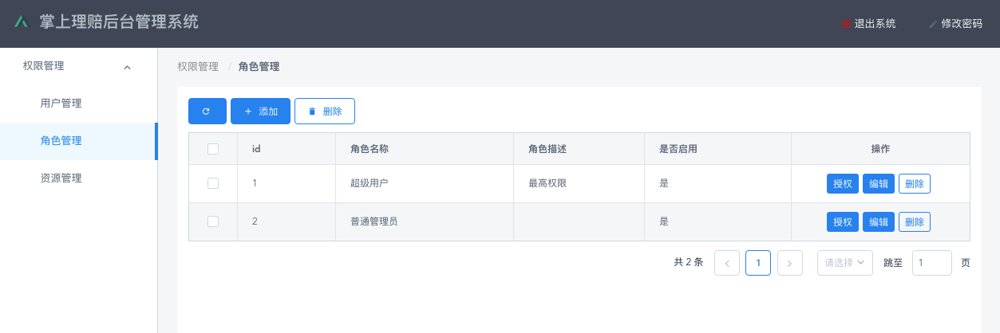
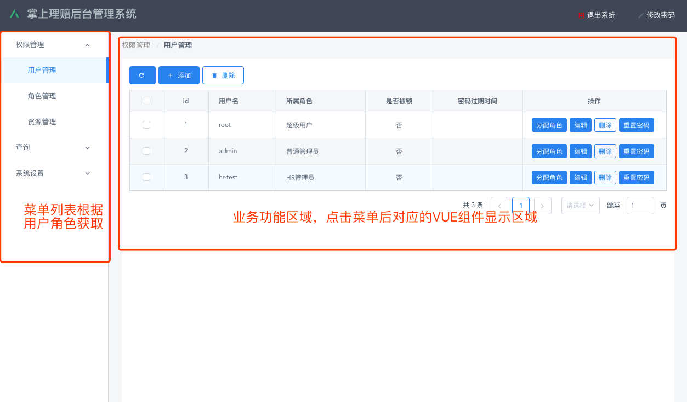
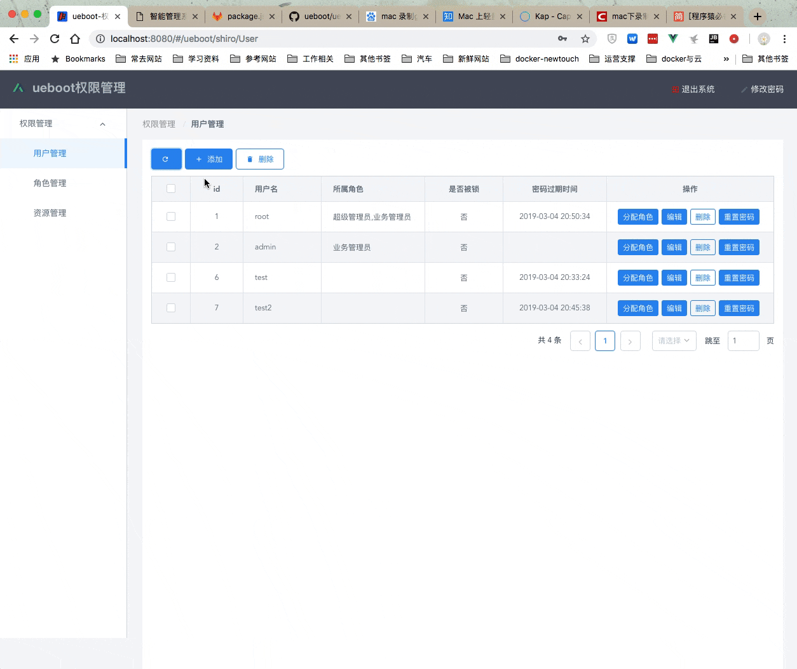

# 官方文档

http://www.ueboot.com

当前使用springboot版本为2.x

# 脚手架工程
 https://github.com/ueboot/ueboot-starter
   当前项目为框架核心代码，无法直接运行使用，可以基于脚手架做二次开发。脚手架工程提供了最基础的代码架构，只需要要导入初始数据库即可。
## 1. 概要介绍
  - ueboot是一个基于`spring boot2 + vue2.0+iview3.0`的基础开发平台，通过这个平台可以快速完成某些CRUD功能的系统（从前端到后端快速实现）
  - 基于iViewUI提供了一套CRUD快速开发UI组件,只需要配置json即可完成单表的CRUD功能，配合后端Java能在1分钟内完成开发。
  - 平台默认提供了安全防范，防止XSS攻击、SQL注入等。
  - 提供代码生成器，生成页面和Java代码，避免纯粹重再复劳动，生成的代码完全可以自主二次修改。
  - 提供最佳实践的开发约定（Maven模块管理、前后端接口、异常、日志、权限等），便于小组协同开发。
  - 基于平台进行二次开发，完全不受平台功能限制，平台提供的功能仅仅帮助大家做了一些开发约定和最佳实践，基于这些约定和最佳实践，让开发提高开发效率，并且保持规范一致性，本质上仅仅是一个基础的开发框架，和自己从零开始搭建的开发框架没任何区别。

 
## 2. 包含的功能


| 序号 | 组件名称 | 版本号 |说明 |
| ------ | ------ | ------ |------ |
1 | ueboot-core | 3.0.0-SNAPSHOT|java核心模块，含安全拦截、统一异常、数据库查询等
2 | ueboot-shiro|3.0.0-SNAPSHOT|权限管理模块，包含了整个权限功能后端代码和前端页面
3 | ueboot-parent|3.0.0-SNAPSHOT|pom.xml文件，开发项目继承此文件即可使用所有组件功能
4 | ueboot-generator|3.0.0-SNAPSHOT|代码生成器，通可以快速生成前后端代码
5 | ueboot-ui|1.5.23|前端UI组件，提供了一套快速开发的CRUD、Tree、权限配置界面等组件
6 | ueboot-excel|xxx|（开发中）excel相关功能
7 | ueboot-weixin|xxx|（开发中）微信相关功能


### 2.1 ueboot-core
    ueboot核心功能，包含了基于spring boot所需要的基础的bean定义以及自定义的一套jpa查询组件。

- 对所有请求和返回的json内容提供日志打印

- 对所有请求内容进行xss拦截\sql注入

- 封装了统一的异常拦截，对外输出标准的错误码和报文

- 对请求内容做统一的格式化校验（基于hibernate validate）,返回统一的错误提示

- 集成了redis缓存，用于保存session会话和spring cache 方法级别的缓存注解。

- 统一了所有接口返回的对象，都使用Response包装内进行包装，保证前端接口获取到的报文体格式一致

- 基于Spring Data JPA 提供了基础的BaseRepository和BaseService,实现了单一Entity类的CRUD功能

- 提供了部分常用工具类
    - 验证码图片输出工具
    - MD5加密工具
    - 固定长度数字格式化成字符工具类，比如：固定订单号长度，不足则用0补
    - 微信接口调用工具类
    - XSS攻击字符过滤工具类
    
### 2.2 ueboot-shiro
权限管理模块，基于apache shiro的一套资源权限管理功能。可以支持前后端接口级别的权限管理，也支持后台管理系统当中的菜单权限。
当前模块包含了权限相关的后台管理界面，因此在集成时需要将页面一并引入。有自己的表、页面、接口服务，在集成时需要考虑前后端一块集成。
  
    
### 2.3 ueboot-parent
用于指定项目所必备的jar包声明，在具体的项目当中使用是，需要继承该pom文件，便于管理jar包依赖，无需关心ueboot框架需要用到哪些jar文件
在需要用到的项目当中（maven多模块情况下通常是父模块的pom.xml文件），继承该pom.xml。示例：
    
``` xml
 <parent>
        <groupId>com.ueboot</groupId>
        <artifactId>ueboot-parent</artifactId>
        <version>3.0.0-SNAPSHOT</version>
        <relativePath/> 
    </parent>
```
> SNAPSHOT 版本目前只发布在maven.xiqiao.io上，需要切换本地maven的仓库地址为maven.xiqiao.io。Release版本会发布到maven中央仓库
可以使用任意的maven仓库地址。    
  
### 2.4 ueboot-generator
    
代码生成器，通过这个模块提供的功能可以快速生成前后端代码，完成一个单表的CRUD功能。代码生成器提供了UI界面，通过UI界面控制要生成的代码。
  

    

### 2.5 ueboot-ui
前端UI组件，基于iviewui封装了一套常用的UI组件，配合后端的规范可以快速的实现CRUD功能。代码生成器生成的前端页面也是基于这个UI组件来实现的。
对于简单的CRUD界面，开发人员只需要配置json数据即可完成整个CRUD功能。另外提供了登录页面、框架主体页面、权限管理页面，对于想快速直接使用的人来说
可以直接集成这些成体系的UI界面，配合后端接口，快速搭建一套具备完整的用户登录、密码修改权限、管理功能

- 登录页面
  
    
- 框架主题页面
  
  
- 用户管理
   
   
- 角色管理
   
   
- 资源管理
    
  
- 增删改查页面
     

> 上面几个图当中的界面都是一个CRUD的界面，包含了新增记录、分页查询、修改和查看记录详情、删除记录、条件查询功能。整个页面只需要一行标签代码结合JSON配置数据
即可实现。


## 3.运行

当前项目可以直接启动ueboot-shiro当后台，ueboot-view当前台，进行开发与测试。ueboot-shiro模块会用到其他模块，可以通过在这个模块当中验证修改的功能

- 启动前台
`cd ueboot-view` 执行 `npm run dev` 需要事先执行过`npm install`
- 启动后台
    - 打开ueboot-shiro模块
    - 初始化数据库，脚本文件在/resources/sql/ueboot-shiro.sql
    - 修改resources/application.yml文件当中的 数据库链接和Redis配置，需要事先初始化好数据库表结构
    - 找到com.ueboot.shiro.ShiroLocalStartApplication 类，直接右键运行即可
- 访问http://localhost:8000/swagger-ui.html 可以查看后台接口文档
- 访问http://localhost:9999 可以操作登录界面，默认用户名ueboot 密码：111111
    
    
## 4.pom修改版本号
```bash
   -- 在项目根目录下直接执行如下命令
    mvn versions:set -DnewVersion=3.0.0-SNAPSHOT
    -- 手工修改ueboot-parent目录下的pom.xml当中涉及到ueboot的版本号

```

## 5.分支说明
- master 最新发布的版本代码，与release最新版本一致
- development 最新开发分支，未发布之前的最新开发代码
- xxx-release 某个发布的版本分支，每次有新版本release时就会新建分支
- xxx-fix 基于某个release版本新建的bug修复分支，完成后会合并到development、master分支（如果能兼容）

## 6.发布记录
- 2.2.0-release\2.2.1-release 2018年左右发布的版本，已经不再维护，仅保留代码
- 3.0.0-release 2019年左右发布的版本，与2.2.0存在不兼容（主要是ueboot-view组件不兼容），属于bug维护，已经有部分生产项目在使用，不在新增新的特性
- 3.1.0 当前最新开发内容，采用最新的spring boot \iview版本开发
