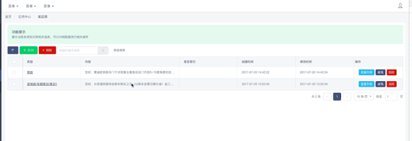

## 1.6 版本更新记录
 > 最新更新时间：{docsify-updated}
    
  > 从1.6.0开始，所有与ueboot相关的配置统一集中到ueboot.Config.setConfig当中。原使用1.5.X的版本需要调整配置

- 1.5更新到1.6调整内容如下
    - 安装依赖`npm install font-awesome --save-dev` `npm install iview --save-dev`
    - main.js
    ```javascript
      import ueboot from 'ueboot'
      import iView from 'iview';
      /*ueboot样式，包含登录页面、主界面、iview样式*/
      import 'ueboot/dist/styles/ueboot.css';
      
      import "font-awesome/less/font-awesome.less"
      
      Vue.use(iView);
      Vue.use(ueboot);
      //axios，log,登录页面配置
      ueboot.Config.setConfig({
          sysTitle: 'ueboot权限管理',
          logoImage: '/static/img/logo.png',
          axios:{baseURL: "", unauthorizedUrl: '/#/login'}
      })

    ```
    - router/index.js文件，引入的权限相关配置，路径发生变化 
    
   ```javascript 
       
        // ueboot提供的权限管理UI界面
       import {Page_Login,Page_Main,Page_Shiro_User,Page_Shiro_Role,Page_Shiro_Resources} from 'ueboot'

    ``` 
    
- v1.6.9
    - 所有使用console.log的地方都改为this.$log()方式，避免IE下无法使用导致页面渲染为空白
- v1.6.8 
    - formGird组件当中的表单title属性支持定义添加、编辑、查看三种状态时不同的title内容
    如：
    ```javascript
      form: {
                labelWidth: 100,
                modal: {
                  title: {
                      add:'添加资源',
                      edit:'编辑资源',
                      view:'资源详情'
                  }
                }
              }
    ```
- v1.6.7
    - 解决查询表单当中的“查询”“重置”两个按钮会换行的问题
- v1.6.6
    - 重置按钮增加click事件，允许自定义事件（默认会先执行表单重置，再执行自定义事件）
    - Main.vue文件当中的菜单位置，默认不隐藏    
- v1.6.2
    -解决打包发布后字体文件丢失的问题    
- v1.6.1
    bug fix
    - 权限管理-资源管理-编辑bug
    - 权限管理-资源管理
    - 多级菜单展示
    - 前台-面包屑 
- v1.6.0
    - 整合ueboot-shiro组件，将原来分开的两个组件合并到一个组件当中，引用的路径发生变化，
    > 更新当前版本后需要调整main.js当中的配置，以及router当中的shiro相关页面路径
    - 统一配置入口，将axios、shiro、log相关配置统一到Config对象当中
    - 源码整合，从当前版本开始发布的包当中会包含源码
    - Utils工具类优化，getTreeData方法当子节点为空时，不返回child属性，防止iview的树结构出现可点击的向下箭头  
    

## 1.5 版本更新记录 

 > 从1.5.0 版本开始，更新iview组件到3.0，去除部分无用代码，部分组件和使用方法不兼容1.5之前的版本
 
 - v1.5.23
  - 解决搜索表单如果有hidden类型的元素时，页面布局会错乱的问题
 - v1.5.22
  - 解决UTree组件传入的数据当中如果有selected和opened属性，无法自动设置为勾选和打开的问题
 - v1.5.21
  - table增加refreshData事件
  - toolbar可以整个隐藏
  - table第一列ID复选框，可以进行覆盖设置，参见table.selection默认值设置
 - v1.5.20
  - 重新约定前后台错误代码的处理行为
 - v1.5.18
  - 表单column增加`equlasTo`字段，校验时自动匹配是否与其他字段值一直，类似确认密码校验
 - v1.5.17
  - 解决部分FormGrid与TreeSelect的bug
  - 解决treeSelect组件使用v-model双向绑定有初始值时，未正确显示的问题
  - 调整UTree返回的内容，由对象改为id,v-modele只绑定id值
 - v1.5.16
  - UFormGrid组件中的table中的columns,针对tooltip的内容提供一套自定义内容事件contentFormat
 - v1.5.13
  - UFormGrid组件中的table增加size属性，可以设置为'large','small'
 - v1.5.12
  - 调整table当中的format方法名称，统一和form保持一致，改为fieldFormat.另外去除renderType属性限制
  - fieldFormat方法中支持返回cellClassName值，允许自定义单元格样式
 - v1.5.11
  - 修改部分交互效果，为表格加载增加loading提示
  - 修改部分组件默认行为
  - 为toolbar增加选项可控制左右布局
  - 修改部分默认样式
 - v1.5.6
  - 解决treeSelect增加required校验时，无法通过的问题
 - v1.5.5
  - 更新iview样式到3.0.1，需要再main.js当中引入一下
  - 解决分页查询参数不正确的问题
  
 
 - v1.5.1
  - 修改UTree组件，废弃原有的组件，重新开发。接口有一定的变动
  - 增加UTreeSelect（树结构下拉框）组件。
  - FormGrid当中支持 type='treeSelect'类型的的表单元素
  
  - 具体使用方式参见相关组件文档
 - v1.5.0
   - 更新iview到3.0
   - 去除1.4当中的setSuperFilter事件，改为新的方式实现，参见‘事件监听’说明
   - 删除Ajax组件，全面采用axios
   - 删除filterParams属性，不再监听改值
   - 优化部分代码
    

## 1.4 版本更新记录 
 > 查询条件布局方式发生重大变更，与1.2、1.3呈现方式不一样
 
- v1.4.5 
  解决日期个格式校验问题
- v1.4.4 
  增加ie兼容性支持组件 babel-polyfill，解决表单未验证的问题
- v1.4.3
  - 统一axios与后台交互逻辑，判断返回报文中的code是否为401，是则自动跳转到登录页面
- v1.4.1
  > 查询条件布局方式发生重大变更
  
  - 修改查询条件表单布局，由原来的弹出模态窗口改为表格上方显示，并增加输入框格式校验功能。json配置方式未变，在superFilter对象上增加3个属性
    - labelWidth:80 与form表单当中的用意一致，默认值为80
    - name:"searchForm", 查询表单名称
    - colNumber:4, 每行放置的formItem个数，默认为4个
  - 新增setSuperFilter() 事件用来重新设置查询条件。比如查询表单当中的某些下拉框需要根据前一个下拉框的值发生变化。因此需要提供事件接口可以进行修改其他查询条件的字段
  

## 1.2 版本更新记录
- v1.3.0
  更新iview组件到2.14版本
- v1.2.75
  修复部分bug。
  axios 支持全局上下文配置。
  升级部分依赖组件版本
- v1.2.72
  对input和date类型增加更多属性支持
- v1.2.70
  Form里面的input将click事件改为focus事件，解决点击输入框时无法触发实际
- v1.2.69
  解决ajax请求上下文无效的问题
- v1.2.36
  放开filterParams参数给外部使用，将查询条件放开给父组件，便于父组件动态修改查询条件
- v1.2.35
  解决分页显示错误的问题


## 历史版本
- v1.1.82
  导入导出label允许自定义
- v1.1.81
  导出功能添加自定义导出列功能
- v1.1.80
  修改分页配置size失效BUG，
- v1.1.76
  解决ajax请求上下文无效的问题
- v1.1.71
  表格数据删除后，页码不变
- v1.1.70
  高级搜索增加宽度选项，可以自定义宽度
- v1.1.68
  高级搜索改为弹出框
- v1.1.67
  优化刷新以及查询
- v1.1.66
  BUG修复（导入）
- v1.1.65
  BUG修复（导出）
- v1.1.64
  废除startsWith方式判断
- v1.1.63
  UFormGrid 导入导出BUG修复
- v1.1.62
  UFormGrid 导入导出功能方式变更详见完整示例
- v1.1.61
  UFormGrid 导入功能BUG修复
- v1.1.60
  UFormGrid 控件添加导入功能
- v1.1.59
  bug fixed
- v1.1.58
  对表格的列渲染增加一个format方法，可以供用户自行格式化数据
- v1.1.57
  为websocket增加close方法
- v1.1.55
  - 解决部分bug
- v1.1.54
  - 导出添加ICON
- v1.1.53
  - 导出BUG修复
- v1.1.52
  - 修改数据导出功能方式
- v1.1.51
  - 对ajax方法如果处理了异常方法，需要增加return true返回值。避免和默认的处理冲突。
- v1.1.50
  - 新增数据表导出功能属性
- v1.1.45
  - 对高级搜索增加是否显示的属性
- v1.1.40
  - bug fixed，解决textarea查看时可以编辑的问题。
- v1.1.39
  - 为表格增加自定义列，目前支持两种tooltip和a标签，a标签可以有额外的事件处理
  
- v1.1.37
  -升级iview到r19
- v1.1.35
  - 解决页面切换时数据不刷新、页面部分组件未刷新的问题
- v1.1.31
  - 解决表单级联输入框校验和取值问题
- v1.1.30
  - 为form表单当中如果是级联属性，支持data:url()的方式远程获取数据
  - 为form表单当中的text类型增加click事件和format事件
  - 为全局提供一个事件监听，可以修改form表单元素的值setFormFieldData(fieldName,data)
- v1.1.28
  - 为调用方提供可以调用组件的事件功能
- v1.1.25
  - 解决grid最后一列的操作按钮无法自定义的问题
- v1.1.24
  - 针对自定义按钮，调用点击事件时，增加传递当前表格选择的数据
- v1.1.21
  - 表单元素增加number类型，当input type="number"时，不需要加入required校验
- v1.1.17
  - 解决编辑提交后，表格重载分页不对的bug
  - 解决Ajax请求，未登录无法跳转的问题
- v1.1.16
  - 解决删除勾选数据不对的问题
  - 表单和高级搜索当中的元素如果是下拉框，支持从数据字典和远程接口获取。
- v1.1.15
  - 解决编辑或查看时，如果调用远程接口，导致表单元素无法渲染
- v1.1.12
  - formGrid进行查看、删除、编辑时传递的primaryKey的名称为定义的名称。
- v1.1.11
  - formGrid form当中的item 如果为input类型时，可以增加prepend,append属性
  - 为form表单元素增加查看、编辑、添加是自定义是否显示、禁用等属性
- v1.1.10
  - formGrid 当中的table.operation.keys 改为primaryKey
  - formGrid 后端接收删除请求时参数为keys,接收方式List<Long> keys
- v1.1.9
  - 完善formGrid功能，为grid增加全选复选框功能
- v1.1.6
  - 为tree增加排序功能
- v1.1.3
  - 增加websocket

- v1.1.0
  - 增加formGrid使用文档
  - 新增log工具

- v1.0.4
  - 初始化发布，实现了tree\fromGrid基础功能。

- v1.0.13
  - 自动关联必要依赖
  - 添加默认样式

